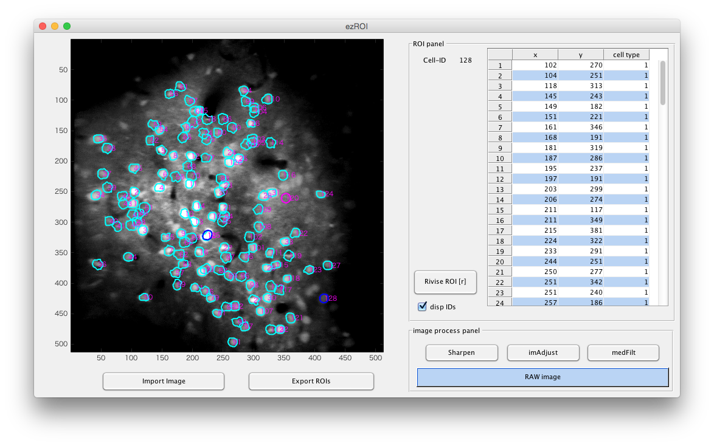

# ezROI

## Description
 - making ROIs with mouse

 - In the future, I'll add something better algorithm for automated cells difine.

## Shortcut & Manipulation
 - z: re-difine current ROI
 - mouse wheel: change ROI sise
 - click datatable => z (or d) : delete ROI  

## arg
 - varag{1} = MxNx3 or MxN image
 - varag{2} = 'B' made with bwboundaries
 - varag{3} = cellType e.g. ones(length(B))
 
## Dependency
 - Image processing toolbox

## Author
*Ryosuke F Takeuchi*
2015 Jan.
