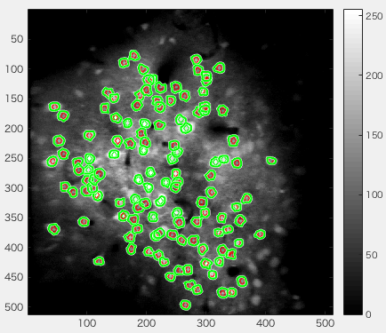

# ezROI

## Description
 - making ROIs with mouse

 - In the future, I'll add something better algorithm for automated cells difine.
 - "demoROI.m" is automation example. You have to get [FastPeakFind.m](http://www.mathworks.com/matlabcentral/fileexchange/37388-fast-2d-peak-finder).

## Shortcut & Manipulation
 - z: re-difine current ROI
 - mouse wheel: change ROI sise
 - Arrow key: move ROI pixel by pixel
 - click datatable => z (or d) : delete ROI  
 - (if revise btn enable) select roi with click
 
## arg
 - varag{1} = MxNx3 or MxN image
 - varag{2} = 'B' made with bwboundaries
 - varag{3} = cellType e.g. ones(length(B))

## Dependency
 - Image processing toolbox
 - [FastPeakFind.m](http://www.mathworks.com/matlabcentral/fileexchange/37388-fast-2d-peak-finder)

## Contribution
 - Any contribution welcome send me pull req or patch.

## Author
*Ryosuke F Takeuchi*
from 2015 Jan.
